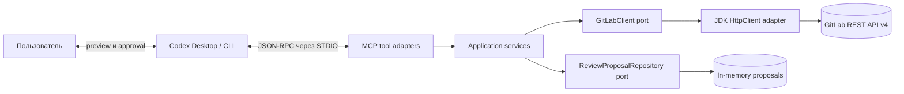

# GitLab Review MCP

Локальный STDIO MCP-сервер с изолированными режимами для ревью merge requests и чтения кодовой базы в self-hosted GitLab. Сервер не клонирует repository и не меняет repository content.

Целевой runtime:

- Java 21;
- Maven 3.6.3+;
- Spring Boot 4.1.1;
- Spring AI 2.0.1;
- MapStruct 1.6.3;
- GitLab 17.2.1 и новее.

## Режимы работы

Один процесс работает только в одном режиме, заданном в `.env`:

```properties
gitlab-review-mcp.mode=REVIEW
```

| Режим | Кодовая база | Доступные операции |
|---|---|---|
| `REVIEW` | Локальный workspace читает сам Codex | MR metadata, diff, discussions, prepare и publish review |
| `REPOSITORY` | Current default branch читается через GitLab API | Group projects, project metadata, tree, UTF-8 files и blob search; write-tools отсутствуют |

`REVIEW` используется по умолчанию для обратной совместимости. В `REPOSITORY` review tools не регистрируются и отсутствуют в MCP `tools/list`, поэтому аналитический агент технически не может подготовить или опубликовать review. В `REVIEW` remote repository tools аналогично отсутствуют: MCP получает MR и комментарии из GitLab, а исходный код и локальные изменения агент читает из workspace Codex.

Неизвестное значение режима останавливает сервер с configuration error.

## Граница публикации в REVIEW

Чтение MR выполняется автоматически. Публикация ревью разделена на две операции:

1. `gitlab_prepare_review` проверяет комментарии по текущему diff, создаёт полный preview, digest и временный proposal в памяти процесса. POST-запросов к GitLab на этом этапе нет.
2. Codex показывает пользователю весь preview.
3. Только после явного подтверждения `gitlab_publish_review` получает `proposalId` и `expectedDigest` и публикует сохранённые комментарии. Текст и позиции повторно передать в write-tool нельзя.

Proposal живёт 15 минут по умолчанию и теряется при завершении MCP-процесса. Изменение head SHA делает proposal устаревшим. Каждый комментарий публикуется отдельной GitLab discussion.

## MCP tools

| Tool | Режим | Операция |
|---|---|---|
| `gitlab_check_connection` | Оба | Проверяет `/version`, `/user`, minimum GitLab version, PAT и capabilities активного режима |
| `gitlab_list_group_projects` | `REPOSITORY` | Возвращает bounded page проектов группы с готовыми project URLs |
| `gitlab_get_project` | `REPOSITORY` | Возвращает metadata проекта и current default branch |
| `gitlab_get_repository_tree` | `REPOSITORY` | Возвращает bounded page дерева current default branch |
| `gitlab_get_repository_file` | `REPOSITORY` | Читает bounded range строк UTF-8 файла из current default branch |
| `gitlab_search_repository_code` | `REPOSITORY` | Ищет по именам и содержимому файлов через GitLab blob search |
| `gitlab_get_merge_request` | `REVIEW` | Возвращает metadata и current head SHA |
| `gitlab_get_merge_request_diff` | `REVIEW` | Возвращает bounded page изменённых файлов и unified diff |
| `gitlab_get_merge_request_discussions` | `REVIEW` | Возвращает discussions, replies, positions и resolved state |
| `gitlab_prepare_review` | `REVIEW` | Проверяет comments и сохраняет immutable preview в памяти |
| `gitlab_publish_review` | `REVIEW` | Публикует ранее подготовленный proposal |

MR принимается только полным URL на настроенном GitLab origin:

```text
https://gitlab.example.com/group/project/-/merge_requests/123
```

Repository tools принимают полный URL корня проекта:

```text
https://gitlab.example.com/group/project
```

Для получения состава группы `gitlab_list_group_projects` принимает полный URL группы:

```text
https://gitlab.example.com/group/subgroup
```

Параметр `includeSubgroups` по умолчанию равен `true`. Проекты, только расшаренные в группу, исключаются. Ответ содержит `webUrl` каждого проекта и `nextCursor`; для полного списка агент должен запрашивать страницы до отсутствия cursor.

Они читают текущее состояние default branch через GitLab API. Локальный checkout и незакоммиченные изменения не учитываются. Для чтения файла используется GitLab `HEAD`, который разрешается в default branch проекта; commit SHA или branch от пользователя не требуется.

Scheme, host, effective port и GitLab URL prefix должны совпадать с `gitlab.base-url`. Project path кодируется сервером. Redirect на другой origin или за пределы настроенного prefix отклоняется до отправки PAT.

## Установка из GitHub Release

Для запуска достаточно Java 21; Maven на машине пользователя не требуется.

1. Откройте последний GitHub Release, например `v0.2.0`, и скачайте один из вариантов:
   - `gitlab-review-mcp-0.2.0.jar` и `.env.example` — standalone installation;
   - `gitlab-review-mcp-0.2.0.zip` — JAR, `.env.example` и README.
2. Распакуйте ZIP либо создайте отдельный каталог и переименуйте standalone JAR в `gitlab-review-mcp.jar`, чтобы путь в MCP config не менялся при обновлении.
3. Скопируйте `.env.example` в `.env` и заполните `gitlab-review-mcp.mode`, `gitlab.base-url` и `gitlab.token`.
4. Укажите абсолютный путь к JAR в `args`, а созданный каталог — в `cwd` конфигурации MCP.
5. Перезапустите агент и вызовите `gitlab_check_connection`.

Пример структуры установленного сервера:

```text
C:\Tools\gitlab-review-mcp\
├── gitlab-review-mcp.jar
└── .env
```

Пример минимальной безопасной конфигурации Codex для `REVIEW`:

```toml
[mcp_servers.gitlab_review]
command = "java"
args = ["-jar", "C:\\Tools\\gitlab-review-mcp\\gitlab-review-mcp.jar"]
cwd = "C:\\Tools\\gitlab-review-mcp"
enabled = true
startup_timeout_sec = 20
tool_timeout_sec = 120
default_tools_approval_mode = "auto"
enabled_tools = [
  "gitlab_check_connection",
  "gitlab_get_merge_request",
  "gitlab_get_merge_request_diff",
  "gitlab_get_merge_request_discussions",
  "gitlab_prepare_review",
  "gitlab_publish_review"
]

[mcp_servers.gitlab_review.tools.gitlab_publish_review]
approval_mode = "prompt"
```

Для `REPOSITORY` используйте отдельную read-only конфигурацию из соответствующего раздела ниже. Файл `SHA256SUMS.txt` содержит SHA-256 checksums release assets. Например, JAR можно проверить в PowerShell:

```powershell
Get-FileHash .\gitlab-review-mcp-0.2.0.jar -Algorithm SHA256
```

## Сборка

```powershell
java -version
mvn -version
mvn clean verify
```

Результат — executable fat JAR:

```text
target/gitlab-review-mcp.jar
```

`verify` запускает unit-тесты, WireMock contract tests, ArchUnit, packaged STDIO integration tests, JaCoCo, Javadoc doclint и Checkstyle. Maven Wrapper намеренно не добавлен.

## Версионирование и GitHub Releases

Проект использует [Semantic Versioning](https://semver.org/):

- `vMAJOR.MINOR.PATCH` для Git tag и GitHub Release;
- `MAJOR.MINOR.PATCH` без префикса `v` в `pom.xml` и MCP server metadata;
- `PATCH` — обратно совместимое исправление;
- `MINOR` — новая обратно совместимая функциональность;
- `MAJOR` — несовместимое изменение публичного MCP API или конфигурации.

Версия в Git tag обязана точно совпадать с версией в `pom.xml`: tag `v0.2.0` публикуется только для Maven version `0.2.0`. Теги и releases не перезаписываются.

Workflow [`.github/workflows/ci.yml`](.github/workflows/ci.yml):

- для pull request запускает `mvn clean verify`;
- при push в `master` собирает и проверяет проект;
- при push tag вида `vX.Y.Z` повторно проверяет проект и соответствие версии `pom.xml`;
- публикует versioned standalone JAR, ZIP bundle, `.env.example` и `SHA256SUMS.txt`;
- создаёт отдельный GitHub Release без перезаписи предыдущих версий и отмечает его как latest.

Release публикуется встроенным `GITHUB_TOKEN`; отдельный PAT или repository secret не требуется. Job публикации имеет только `contents: write`, остальные jobs работают с `contents: read`.

Перед первым release проверьте настройки GitHub repository:

1. GitHub Actions разрешены в `Settings` → `Actions` → `General`.
2. Организационная policy не запрещает `contents: write` для `GITHUB_TOKEN`.
3. Ruleset/tag protection разрешает workflow создавать release для tags вида `vX.Y.Z`.

Создание новой версии:

```powershell
mvn versions:set -DnewVersion=0.2.0 -DgenerateBackupPoms=false
mvn clean verify
git add pom.xml
git commit -m "release: v0.2.0"
git push origin master
git tag -a v0.2.0 -m "Release v0.2.0"
git push origin v0.2.0
```

Сначала отправляется commit в `master`, затем tag: workflow разрешает release только для tag, указывающего на текущую вершину `master`. Если tag не соответствует строгому формату `vX.Y.Z`, версия отличается от `pom.xml` или release уже существует, публикация завершается ошибкой без перезаписи существующих артефактов.

## Personal Access Token

Создайте отдельный PAT в настройках своей учётной записи GitLab:

- `REVIEW`: scope `api`, поскольку сервер публикует discussions;
- `REPOSITORY`: scope `read_api`, без write-доступа;
- короткий срок действия;
- понятное имя, например `gitlab-review-mcp-local`.

Для аналитиков рекомендуется отдельный read-only PAT. Не добавляйте token в Codex config, JVM arguments или Git history.

## `.env`

Скопируйте пример и заполните локальный файл:

```powershell
Copy-Item .env.example .env
```

Минимальная конфигурация:

```properties
gitlab-review-mcp.mode=REVIEW
gitlab.base-url=https://gitlab.example.com
gitlab.token=replace-me
```

Полный пример находится в [`.env.example`](.env.example). `.env` игнорируется Git. Spring Boot загружает extensionless properties-файл через `spring.config.import`; дополнительная dotenv-библиотека не используется.

Если GitLab установлен с relative URL root, включите prefix в base URL:

```properties
gitlab.base-url=https://intranet.example.com/gitlab
```

Обычный HTTP, отключение hostname verification и trust-all TLS не поддерживаются.

## Corporate CA

Создайте отдельный PKCS12 truststore с корпоративным CA, не меняя глобальный JDK truststore:

```powershell
keytool -importcert `
  -alias corporate-root-ca `
  -file C:\certificates\corporate-root-ca.cer `
  -keystore C:\secure\gitlab-review-truststore.p12 `
  -storetype PKCS12
```

Добавьте путь и пароль в `.env`:

```properties
gitlab.ssl.trust-store-path=C:/secure/gitlab-review-truststore.p12
gitlab.ssl.trust-store-password=replace-me
gitlab.ssl.trust-store-type=PKCS12
```

Truststores (`*.jks`, `*.p12`, `*.pfx`) исключены из Git.

## Подключение REVIEW к Codex Desktop и CLI

Установите `gitlab-review-mcp.mode=REVIEW` в `.env`, соберите JAR и добавьте сервер в Codex `config.toml`:

```toml
[mcp_servers.gitlab_review]
command = "java"
args = [
  "-jar",
  "C:\\absolute\\path\\gitlab-review-mcp\\target\\gitlab-review-mcp.jar"
]
cwd = "C:\\absolute\\path\\gitlab-review-mcp"
enabled = true
startup_timeout_sec = 20
tool_timeout_sec = 120
default_tools_approval_mode = "auto"
enabled_tools = [
  "gitlab_check_connection",
  "gitlab_get_merge_request",
  "gitlab_get_merge_request_diff",
  "gitlab_get_merge_request_discussions",
  "gitlab_prepare_review",
  "gitlab_publish_review"
]

[mcp_servers.gitlab_review.tools.gitlab_publish_review]
approval_mode = "prompt"
```

## Подключение REPOSITORY к Codex Desktop и CLI

Для аналитической установки задайте в `.env`:

```properties
gitlab-review-mcp.mode=REPOSITORY
```

Используйте отдельное имя MCP server и только read-only allowlist:

```toml
[mcp_servers.gitlab_repository]
command = "java"
args = [
  "-jar",
  "C:\\absolute\\path\\gitlab-review-mcp\\target\\gitlab-review-mcp.jar"
]
cwd = "C:\\absolute\\path\\gitlab-review-mcp"
enabled = true
startup_timeout_sec = 20
tool_timeout_sec = 120
default_tools_approval_mode = "auto"
enabled_tools = [
  "gitlab_check_connection",
  "gitlab_list_group_projects",
  "gitlab_get_project",
  "gitlab_get_repository_tree",
  "gitlab_get_repository_file",
  "gitlab_search_repository_code"
]
```

`cwd` должен указывать на корень проекта, потому что `.env` загружается относительно working directory. Локальные STDIO servers и per-tool approval настраиваются средствами [Codex MCP configuration](https://developers.openai.com/codex/mcp/).

После изменения конфигурации перезапустите Codex Desktop. Проверка:

```powershell
codex mcp list
```

В Desktop список доступен через `/mcp`. После успешного подключения вызовите `gitlab_check_connection`.

## Сценарий: анализ удалённой кодовой базы

Передайте Codex полный URL проекта и сформулируйте вопрос о текущей реализации. Агент:

1. при необходимости получает URL проектов группы через `gitlab_list_group_projects`;
2. получает metadata и имя default branch через `gitlab_get_project`;
3. ищет классы, методы или конфигурацию через `gitlab_search_repository_code`;
4. при необходимости обходит каталоги через `gitlab_get_repository_tree`;
5. читает релевантные файлы частями через `gitlab_get_repository_file`;
6. формирует ответ только по состоянию удалённого default branch.

Пример запроса:

```text
Используй gitlab_repository и проверь проект
https://gitlab.example.com/group/project.
Объясни, как сейчас реализован расчёт лимитов и где он конфигурируется.
Ничего не публикуй и не изменяй.
```

Чтобы сначала собрать URL всех проектов группы:

```text
Используй gitlab_repository и вызови gitlab_list_group_projects для группы
https://gitlab.example.com/group/subgroup с includeSubgroups=true.
Пройди все страницы по nextCursor и верни name, pathWithNamespace, webUrl,
defaultBranch и archived для каждого проекта. Ничего не изменяй.
```

`gitlab_search_repository_code` использует GitLab project search с `scope=blobs`. Доступность и качество поиска зависят от конфигурации поиска на GitLab instance. Если search недоступен, агент может найти файлы через постраничный обход tree.

## Сценарий: доработка собственного MR

В существующей задаче Codex передайте URL своего MR и попросите учесть замечания. Агент:

1. читает metadata, diff и все страницы discussions;
2. сопоставляет unresolved comments и replies с локальным workspace и контекстом задачи;
3. продолжает реализацию и запускает тесты;
4. не использует GitLab MCP для изменения repository content.

## Сценарий: ревью чужого MR

В отдельной задаче Codex передайте URL MR и дополнительный контекст: Jira, Confluence или требования. Агент:

1. читает metadata, diff и existing discussions;
2. проверяет реализацию относительно переданного контекста;
3. формирует потенциальные замечания;
4. вызывает `gitlab_prepare_review`;
5. показывает полный preview с `proposalId`, digest и expiration;
6. ждёт явного подтверждения;
7. вызывает `gitlab_publish_review` через approval prompt.

Jira и Confluence остаются контекстом Codex и не передаются этому MCP-серверу.

## Partial и unknown publication

Состояния proposal:

- `PREPARED` — preview готов;
- `PUBLISHING` — выполняется последовательная публикация;
- `PARTIAL` — часть comments опубликована, гарантированно неотправленные можно повторить;
- `PUBLISHED` — все discussion созданы;
- `UNKNOWN` — outcome POST неизвестен, автоматический retry запрещён;
- `EXPIRED` — TTL истёк.

При deterministic GitLab error уже созданные discussion IDs сохраняются, а повторный approved publish отправляет только `PENDING` comments. Timeout или I/O failure после начала POST переводит item в `UNKNOWN`: перечитайте discussions и подготовьте новое ревью, чтобы не создать дубликат.

## Ограничения

По умолчанию:

- 50 comments на proposal;
- 10 000 символов на comment;
- 500 changed files;
- 10 MB на JSON response;
- 5 MB diff content на page;
- 2 MB на читаемый repository file;
- 500 строк файла на один tool call;
- 500 символов в code search query;
- 100 proposals в памяти;
- TTL proposal 15 минут.

Для больших MR tools возвращают `nextCursor`, `truncated` и `warnings`. Перед анализом нужно пройти pagination до отсутствия `nextCursor`.

## Диагностика

| Симптом | Проверка |
|---|---|
| MCP startup failure | Java 21, абсолютный путь к JAR, `cwd`, наличие `.env` |
| `GITLAB_UNAUTHORIZED` / HTTP 401 | PAT существует, не истёк и корректно скопирован |
| `GITLAB_FORBIDDEN` / HTTP 403 | scope `api` и доступ пользователя к project/MR |
| TLS handshake error | corporate CA импортирован в указанный truststore |
| timeout | GitLab/VPN доступен, увеличьте `gitlab.read-timeout` |
| `UNSUPPORTED_GITLAB_VERSION` | требуется GitLab 17.2.1+ |
| `INVALID_DIFF_POSITION` | head/diff изменился или line отсутствует на выбранной стороне |
| `PROPOSAL_NOT_FOUND` | MCP был перезапущен или истёк TTL; выполните prepare заново |
| stale head | перечитайте MR и сформируйте новый proposal |

Логи идут только в `stderr`; `stdout` зарезервирован для MCP JSON-RPC. Token, request headers, `.env`, environment и stack traces не входят в tool responses.

## Архитектура

Упрощённая схема взаимодействия компонентов:



Group, project и MR read tools проходят по цепочке до GitLab API. Repository tools получают проекты через Groups API и читают default branch напрямую через Project, Repository Tree, Repository Files и Search API без локального checkout. `gitlab_prepare_review` проверяет комментарии и сохраняет proposal только в памяти. `gitlab_publish_review` обращается к GitLab после показа preview и явного approval пользователя.

Подробная схема и правила зависимостей: [`docs/architecture.md`](docs/architecture.md).

## Разработка и безопасность

- [`CONTRIBUTING.md`](CONTRIBUTING.md)
- [`SECURITY.md`](SECURITY.md)

Лицензия намеренно не добавлена.
