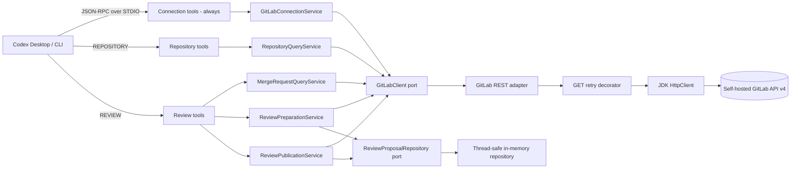
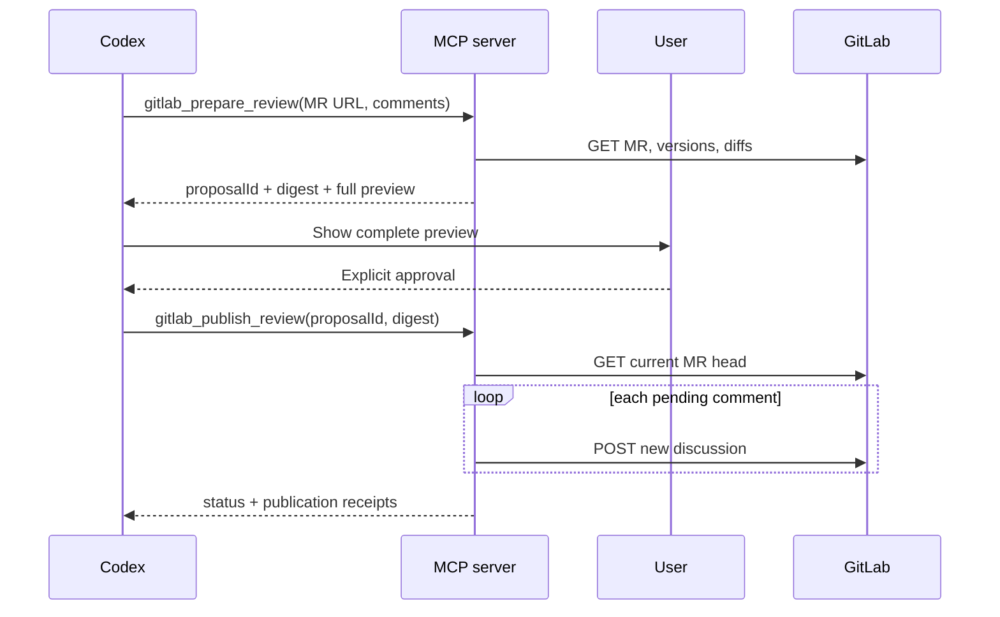

# Architecture

Проект использует ports-and-adapters. Domain и application не зависят от Spring, MCP или HTTP; направление проверяется ArchUnit.

Conditional adapters регистрируют взаимоисключающие tool sets. В `REVIEW` исходный код читает Codex из локального workspace, а MCP работает только с MR API. В `REPOSITORY` `RepositoryQueryService` принимает trusted group/project URLs, получает состав групп через Groups API и читает текущее состояние default branch через Project, Repository Tree, Repository Files и Search API. Локальный checkout не используется; repository content не записывается на диск.

## Packages

- `domain` — proposal aggregate, sealed comment hierarchy, atomic publication state;
- `application` — use cases, validation, digest and ports;
- `infrastructure.gitlab` — URL policy, generated MapStruct DTO mapping, bounded HTTP, retry and TLS;
- `infrastructure.proposal` — bounded process-local storage with TTL cleanup;
- `infrastructure.mcp` — annotated tool boundary and structured errors;
- `configuration` — validated Spring configuration and composition root.

## Write boundary

`gitlab_publish_review` не принимает comment bodies или positions. Это исключает подмену preview непосредственно перед POST.
